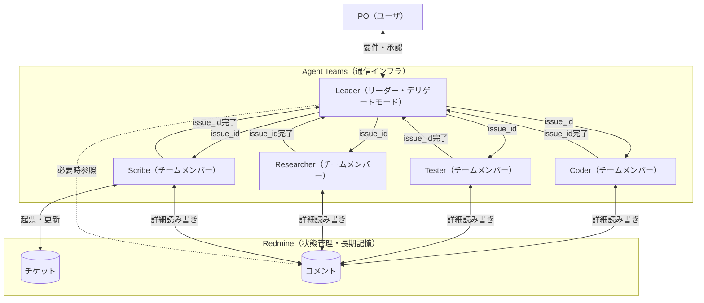
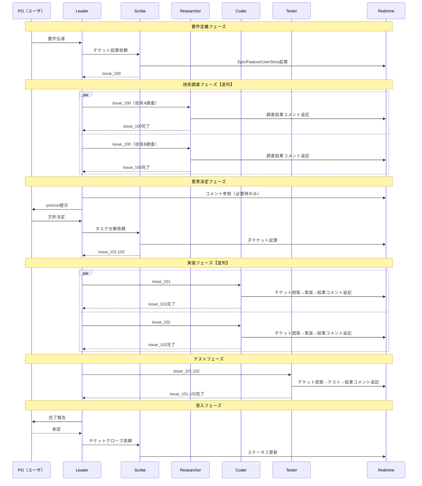

# ticket-tasuki アーキテクチャ再検討（Agent Teams評価）

2026/02/08 議論記録

## 目的

Claude Code公式のAgent Teams機能（実験的）の登場を受け、ticket-tasukiの中長期アーキテクチャ方針を再検討する。

前提: アーキテクチャ再検討_20260202.mdの結論「方式D（Conductor + general-purpose + Redmine MCP）で小さく検証」は維持。本ドキュメントはAgent Teams GA後の移行パスを設計する。

---

## 1. Agent Teams概要

出典: /workspace/docs/apis/agent-teams.md（公式ドキュメント日本語訳）

### 構成要素

| コンポーネント | 役割 |
|---|---|
| チームリーダー | チーム作成・メンバースポーン・作業調整 |
| チームメンバー | 独立Claude Codeインスタンスとして動作 |
| 共有タスクリスト | 作業項目管理（blockedBy依存関係サポート） |
| メールボックス | エージェント間メッセージングシステム |

### subagentとの比較

| 観点 | subagent | Agent Teams |
|---|---|---|
| コンテキスト | 独自（親への漏洩バグあり） | 独自（完全独立） |
| 通信 | 親にのみ報告 | メンバー間直接通信可 |
| MCP | GP:可 / カスタム:不可 | 公式: 各メンバーで利用可 / **実態: 不安定（後述§9）** |
| 調整 | 親が全管理 | 共有タスクリスト+自己調整 |
| トークンコスト | 低（結果要約） | 高（plan mode時に約7倍、公式ドキュメント記載） |

### 現時点の制限事項（実験的機能 + コミュニティ報告）

公式ドキュメント記載の制限に加え、2026/02/05リリースから4日間で**50件以上のバグ報告**がGitHub Issuesに起票されている（詳細は§9）。

| 制限 | ticket-tasukiへの影響 | 出典 |
|---|---|---|
| `/resume`でin-processメンバー復元不可 | セッション切断時にチーム再構築必要 | 公式ドキュメント |
| セッションあたり1チーム | 問題なし（1プロジェクト1チーム） | 公式ドキュメント |
| ネストチーム不可 | 問題なし | 公式ドキュメント |
| リーダー固定（交代不可） | 問題なし | 公式ドキュメント |
| タスクステータス遅延の既知問題 | Redmine管理で回避可能 | 公式ドキュメント |
| 分割ペインにtmux/iTerm2必要 | in-processモードで回避可能 | 公式ドキュメント |
| **メンバーからMCPアクセスが不安定** | **条件次第でRedmine MCP利用不可の可能性（後述§9.2）** | #23882, #23999 |
| **デリゲートモードがメンバーにカスケード** | **メンバーが全ツール使用不能→作業不可** | #23447, #24073 |
| **コンテキスト圧縮でチーム認識喪失** | リーダーがチームの存在を忘却 | #23620 |
| **InboxPollerがコンテキスト爆発** | 101k→205k急増→セッション回復不能 | #23876 |
| **長時間セッションで役割劣化** | 役割境界崩壊、重複作業開始（Agent Teams固有ではなくマルチエージェント一般の現象） | #24256 |
| **3メンバーで13GB RAM消費** | 5メンバー構成では更に深刻 | #23883 |
| **PermissionRequestフックがメンバーで不発火** | claude-naggarのhook連携に影響 | #23983 |

---

## 2. Agent Teamsが解決する既存課題

| 既存課題（再検討_20260202記載） | Agent Teamsでの解決 | 実態（コミュニティ調査） |
|---|---|---|
| subagent→subagent通信不可 | メンバー間直接メッセージング | **動作するが、InboxPollerのコンテキスト爆発リスクあり**（#23876） |
| オーケストレーター実装コスト（方式C） | Claude Code本体が調整を担当 | 動作する |
| general-purpose識別問題 | 自然言語で名前・役割を付与 | 動作する（ただし長時間セッションで劣化の報告あり。Agent Teams固有ではなくマルチエージェント一般の現象 #24256） |
| `run_in_background`でMCP不可 | 各メンバーが独立セッションでMCP利用可 | **メンバーからMCPアクセス不可の報告多数**（#23882, #23999） |
| 親コンテキスト肥大化（漏洩バグ#14118） | 物理的に完全分離 | 動作する（ただしcompactionでチーム喪失 #23620） |
| カスタムagentでMCP不可（#13605） | 各メンバーがフルClaude Codeセッション | **MCP問題は別形で残存** |

---

## 3. 設計原則: チケットIDポインタ渡し

### 核心

**Agent Teams = 通信インフラ、Redmine = 状態管理・長期記憶**

Agent Teamsの調整機能（共有タスクリスト・メールボックス）は**揮発性**（セッション終了で消失）。Redmineは**永続性**。この特性差を活かし、Agent Teamsを通信路としてのみ使用し、状態管理はRedmineに一本化する。

### 通信規約

```
メンバー間メッセージ: チケットIDのみ（例: "issue_124完了"）
詳細情報: 必ずRedmineチケットコメントに記載
他メンバーの作業詳細が必要な場合: Redmineコメントを参照
```

### 効果

| 観点 | 効果 |
|---|---|
| トークン効率 | メンバー間で大量テキストが流通しない。コンテキスト消費を大幅削減 |
| レート制限緩和 | メンバー数比例のトークンスケーリング問題を実質的に緩和 |
| 永続性 | セッション死亡・チームクリーンアップでも全履歴がRedmineに残存 |
| 再構築可能性 | チケットを読めばコンテキスト再構築可能。`/resume`不可の制限を回避 |
| 監査証跡 | 人間がいつでもチケットで進捗・意思決定を確認可能 |
| 原則との整合 | 「Redmineに書いてないことは存在しない」を完全に維持 |

### Agent Teams機能の取捨選択

| Agent Teams機能 | 利用判断 | 理由 |
|---|---|---|
| メンバー間直接メッセージ | **使う**（IDのみ） | 軽量通知（"issue_124完了"等） |
| 共有タスクリスト | **使わない** | Redmineチケット階層で代替。二重管理回避 |
| タスク依存関係（blockedBy） | **使わない** | Redmineバージョン・親子関係で管理 |
| プラン承認 | **使う** | リーダーがRedmineコメントを読んで承認/却下 |
| デリゲートモード | **GA後に再検証** | 原則と一致するが、現時点ではメンバーにカスケードし全員作業不能になるバグあり（#23447） |
| broadcast | **控えめに** | 全メンバーにコスト発生。必要最小限 |

---

## 4. 方式比較（更新版）

| 観点 | A: subagent | C: CLI+Redmine | D: Conductor | **E: Agent Teams+Redmine** |
|---|---|---|---|---|
| 追加実装 | 低（既存） | 高 | なし | **なし（GA後）** |
| MCP | GP:可 / カスタム:不可 | 可 | 可（GP使用） | **公式: 可 / 実態: 不安定（#23882）** |
| コンテキスト分離 | 漏洩バグあり | 物理分離 | 漏洩バグあり | **完全分離** |
| メンバー間通信 | 不可 | オーケストレーター経由 | 不可 | **直接通信** |
| セッション再開 | 不可 | 可 | 不可 | **不可（実験的制限）** |
| タスク管理 | 手動 | オーケストレーター | blockedBy宣言的 | **Redmine一本化** |
| 暗黙知排除 | hook併用 | Redmine強制 | prompt+hook | **チケットID規約+hook** |
| トークンコスト | 低 | 中 | 低 | **高（ID規約で緩和）** |
| 外部依存 | なし | Python+オーケストレーター | なし | **なし（公式機能）** |
| 安定性 | 安定 | 未実装 | 安定 | **実験的（4日間で50件超バグ報告）** |
| リソース消費 | 低 | 中 | 低 | **高（3メンバーで13GB RAM #23883）** |

---

## 5. Agent Teams移行時のワークフロー図



### シーケンス図



---

## 6. 懸念事項と対策

### 設計レベルの懸念

| 懸念 | 対策 |
|---|---|
| Anthropicが共有タスクリスト無視の使い方を想定していない | リーダープロンプトで「タスクリストは使わない。Redmineで判断」を明示 |
| リーダーが「タスクリスト空=完了」と判断しチーム早期シャットダウン | プロンプトで「Redmineチケットのステータスで完了判断」を指示 |
| GA時にAPI変更の可能性 | 方式D（Conductor）で運用実績を積みつつ移行パスを維持 |
| トークンコスト増大（plan mode時に約7倍、公式ドキュメント記載） | チケットID規約で実質緩和。bypassPermissionsモードでの倍率は不明 |
| メンバーがRedmineでなくメッセージで詳細を送ってしまう | claude-nagger hookで長文メッセージ検知→警告。プロンプトで規約強制 |

### コミュニティ調査で判明した懸念（§9参照）

| 懸念 | 深刻度 | 対策 | 状態 |
|---|---|---|---|
| **メンバーからMCPアクセスが不安定**（#23882, #23999） | 高 | GA待ち。in-process+プロジェクトスコープMCPでの検証必要 | OPEN |
| **デリゲートモードがメンバーにカスケード**（#23447, #24073, #24307） | 高 | GA待ち。ワークアラウンド: メンバーを先にスポーンしてからデリゲートモードに切替。ただし動的メンバー追加不可 | OPEN |
| **コンテキスト圧縮でチーム認識喪失**（#23620） | 高 | Redmine永続性でカバー。チーム再構築時にチケット参照で復帰 | OPEN |
| **InboxPollerコンテキスト爆発**（#23876） | 致命的 | チケットIDポインタ渡し規約でメッセージ量を最小化 | OPEN |
| **長時間セッションで役割劣化**（#24256） | 中 | Agent Teams固有ではなくマルチエージェント一般の現象（外部オーケストレーションでの観察報告）。claude-naggerによるガードレール、チケットIDによる都度指示で緩和 | OPEN (autoclose) |
| **3メンバーで13GB RAM**（#23883） | 高 | メンバー数を最小限に。段階的追加 | OPEN |
| **PermissionRequestフックがメンバーで不発火**（#23983） | **致命的** | **claude-nagger統合の最大ブロッカー**。メンバーの行動監視・制御が無効化される。対策: (1) PreToolUse/PostToolUse hookがメンバーで動作するか検証 (2) bypassPermissions+PreToolUseで代替監視 (3) 本issue修正待ち | OPEN |
| **間違ったMCP設定のサイレント読み込み**（#23475） | 高 | MCPサーバー名をプロジェクト固有にする | OPEN |
| **tmux/iTerm2統合の不安定さ**（#23415等多数） | 中 | in-processモード使用で回避 | OPEN |
| **同名メンバーの重複タスク主張**（#23884） | 中 | 共有タスクリストを使わない設計で回避 | OPEN |

---

## 7. 方式D→方式E移行パス

### 変わらないもの

- 「Redmineに書いてないことは存在しない」原則
- チケットIDポインタ渡し規約
- agents/*.mdの規約定義書
- claude-naggerによるガードレール
- Redmine MCPの利用

### 変わるもの

| 観点 | 方式D（Conductor） | 方式E（Agent Teams） |
|---|---|---|
| subagent起動 | Task tool（general-purpose） | チームメンバースポーン |
| 通信路 | Task toolの戻り値 | メールボックス（ID のみ） |
| 役割識別 | `[ROLE:xxx]`プレフィックス | メンバー名で自然に識別 |
| リーダー制約 | プロンプトで自制 | デリゲートモード（#23447修正後） |
| MCP利用 | フォアグラウンド必須 | 各メンバーで自由に利用可 |

### 移行手順（GA後）

1. Agent Teams有効化
2. 小規模タスクでLeader + Scribe + Coderの3メンバーで検証
3. 以下のGA移行チェックリストを全て通過することを確認
4. チケットID規約の遵守を確認（メッセージにID以外の詳細が含まれないか）
5. Redmine参照なしにチーム早期終了しないかを確認
6. claude-nagger hookのAgent Teams対応（SubagentStart→チームメンバー識別）
7. 問題なければメンバー拡大（Tester, Researcher追加）

### GA移行チェックリスト

コミュニティ調査（§9）で判明した問題の解消確認:

- [ ] **MCP伝搬**: 全メンバーからRedmine MCPが利用可能か（#23882, #23999）
- [ ] **デリゲートモード**: リーダーのデリゲートモードがメンバーにカスケードしないか（#23447）
- [ ] **フック発火**: claude-naggarのPreToolUseフックが全メンバーで動作するか（#23983）
- [ ] **コンテキスト圧縮耐性**: リーダーのcompaction後にチーム認識が維持されるか（#23620）
- [ ] **Inbox安定性**: InboxPollerがコンテキスト爆発しないか（#23876）
- [ ] **MCP設定分離**: 正しいプロジェクトのMCP設定が読み込まれるか（#23475）
- [ ] **メモリ消費**: メンバー構成ごとのRAM使用量を実測（#23883）
- [ ] **役割維持**: 長時間セッションで役割劣化が発生しないか（#24256）

---

## 8. 結論

### 短期（現時点）

**方式D（Conductor）を継続。** Agent Teamsはリリース4日で50件超のバグ報告があり、MCP周りの不安定さ（#23882, #23999）やデリゲートモードカスケード（#23447）等、実験的機能としての品質リスクが高い。

### 中期（Agent Teams GA後）

**方式E（Agent Teams + Redmine）へ移行検証。** §7のGA移行チェックリスト全項目の通過を必須条件とする。特に以下が最低要件:
- **PermissionRequestフックのメンバー対応（#23983）** — claude-nagger統合の最大ブロッカー。PreToolUse hookの動作検証が最優先
- メンバーからのMCPアクセス安定化（#23882, #23999。特にin-process+プロジェクトスコープMCPでの動作確認）
- デリゲートモードのカスケード修正（#23447）
- InboxPollerの安定化（#23876）

### 設計原則（時間軸を問わず）

**チケットIDポインタ渡し**: Agent間通信はチケットIDのみ。詳細は必ずRedmineコメント。この原則は方式D/E共通であり、移行に影響しない。

コミュニティ調査の結果、この設計判断は以下の実データで裏付けられた:
- InboxPollerコンテキスト爆発（#23876）→ メッセージ量最小化の必要性
- 共有タスクリスト同期問題（#23629）、重複作業（#23884）→ Redmine一本化の妥当性
- セッション復元不可・チーム喪失（#23620）→ Redmine永続性によるカバーの必要性

---

## 9. コミュニティ調査結果

調査日: 2026/02/08、対象期間: 2026/02/05（リリース日）〜2026/02/09

### 9.1 調査概要

Agent Teamsは2026/02/05にOpus 4.6と同時にリサーチプレビューとしてリリース。4日間で50件以上のバグ報告がGitHub Issues（anthropics/claude-code）に起票された。

### 9.2 MCP統合の問題（ticket-tasukiに最も影響大）

| Issue | 概要 | 発生条件 |
|---|---|---|
| [#23882](https://github.com/anthropics/claude-code/issues/23882) | メンバーがToolSearch/遅延MCPツールにアクセス不可 | **カスタムagentをメンバーとしてスポーン時** |
| [#23999](https://github.com/anthropics/claude-code/issues/23999) | プラグイン由来MCPサーバーが起動失敗（`CLAUDE_PLUGIN_ROOT`未伝搬） | **分割ペインモード + プラグインMCP** |
| [#23475](https://github.com/anthropics/claude-code/issues/23475) | 間違ったプロジェクトの`.mcp.json`をサイレント読み込み→異なるサービスに接続 | **context:forkスキル経由のスポーン** |
| [#23625](https://github.com/anthropics/claude-code/issues/23625) | メンバーがToolSearchをツールリストで確認不可 | 未詳 |

**注記**: ticket-tasukiの想定構成（in-processモード + プロジェクトスコープのRedmine MCP）での動作は**未検証**。上記報告は異なる条件下での問題であり、直ちに方式Eの前提が崩れるとは断定できない。ただしMCP周りの不安定さは事実であり、GA移行時の検証項目として必須。

### 9.3 権限・デリゲートモードの問題

| Issue | 概要 | ファクトチェック |
|---|---|---|
| [#23447](https://github.com/anthropics/claude-code/issues/23447) | デリゲートモードがメンバーにカスケード→Bash/Read/Write/Edit全不可→全員作業不能 | ✅ 正確。macOS/Linux/WSL2の3環境で再現。ワークアラウンド: メンバースポーン後にデリゲートモード切替（ただし動的メンバー追加不可） |
| [#24073](https://github.com/anthropics/claude-code/issues/24073) | `bypassPermissions`設定にもかかわらずメンバーのツールアクセス喪失 | ✅ 正確。#23447の詳細再現。根本原因仮説: `effective_permissions = min(mode_param, lead_session_state)` |
| [#23983](https://github.com/anthropics/claude-code/issues/23983) | PermissionRequestフックがメンバーの権限要求で発火しない | ✅ 正確。**claude-nagger統合の最大ブロッカー**。外部プロジェクト(claude-telegram-hook)でも同問題を確認 |
| [#23679](https://github.com/anthropics/claude-code/issues/23679) | Read toolの承認不要ドキュメントと矛盾してメンバーが承認要求 | 未検証 |

### 9.4 コンテキスト・安定性の問題

| Issue | 概要 | ファクトチェック |
|---|---|---|
| [#23620](https://github.com/anthropics/claude-code/issues/23620) | コンテキスト圧縮発動→チーム認識完全喪失。`/resume`不可 | ✅ 正確。200Kに近づき圧縮が複数回トリガー後に発生。16ページAstroサイト作業中の報告 |
| [#23876](https://github.com/anthropics/claude-code/issues/23876) | InboxPollerが全キューメッセージ一括配送→101k→205k→回復不能 | ✅ 正確。数値含め精密一致。7メッセージ一括配信、3秒で2倍、compact agentがサイレント失敗 |
| [#24256](https://github.com/anthropics/claude-code/issues/24256) | 長時間セッションで役割専門化が劣化、重複作業開始 | ⚠️ 条件付き。**Agent Teams固有ではなく外部マルチエージェントオーケストレーションでの観察報告**。autocloseラベル付き |
| [#24130](https://github.com/anthropics/claude-code/issues/24130) | MEMORY.md並行書き込みでサイレントデータ消失 | 未検証 |

### 9.5 リソース消費

| Issue | 概要 |
|---|---|
| [#23883](https://github.com/anthropics/claude-code/issues/23883) | 3メンバー+リーダーで13GB RAM、セッション終了時16GBに急増 |
| [#23717](https://github.com/anthropics/claude-code/issues/23717) | Linux 32GB RAM/32コア環境で2-3メンバースポーン→数分でシステムフリーズ（3/3再現） |
| [#23877](https://github.com/anthropics/claude-code/issues/23877) | シャットダウン後にセッション応答不能→14時間放置後killが必要 |

### 9.6 トークン・コスト

| データ | 出典 | ファクトチェック |
|---|---|---|
| plan mode時に約7倍のトークン消費 | [公式ドキュメント](https://code.claude.com/docs/en/costs) | ⚠️ 条件付き正確。**plan mode時**の数値。bypassPermissionsモードでの倍率は不明 |
| Anthropic公式ストレステスト: 16エージェント×2,000セッション=$20,000 | [Anthropic Engineering Blog](https://www.anthropic.com/engineering/building-c-compiler) | ✅ 正確（ただしAgent Teams機能ではなくカスタムハーネスでの並列実行） |
| 一般的なClaude Codeコスト: 開発者1人あたり平均$6/日 | [Claude Code Docs](https://code.claude.com/docs/en/costs) | ✅ 正確 |

### 9.7 コミュニティ採用事例

| 事例 | 規模 | 用途 | 出典 | 備考 |
|---|---|---|---|---|
| Anthropic Cコンパイラ構築 | 16エージェント | Rustベース100,000行のCコンパイラ | [Anthropic Engineering](https://www.anthropic.com/engineering/building-c-compiler) | **Agent Teams機能ではなくカスタムハーネスで並列実行**。gitとテキストファイルロックで同期 |
| Addy Osmani推奨パターン | 2-5メンバー | リサーチ・レビュー・並列仮説検証 | [AddyOsmani.com](https://addyosmani.com/blog/claude-code-agent-teams/) | メンバーあたり5-6タスク推奨 |
| コードベースレビュー | 6エージェント | 全コードベースレビュー→即修正13件+要検討22件 | コミュニティ報告 | |
| Opus 4.6コードレビュー | 4エージェント | 各エージェントが異なる分析視点を自律的に発展 | [zerofuturetech](https://zerofuturetech.substack.com/p/i-spent-two-days-with-claude-agent) | |

### 9.8 ポジティブレポート・成功条件

**成功している用途**: リサーチ・レビュー等の**読み取り中心タスク**。コード生成や長時間のステートフル作業では問題報告が多い。

**MCP + Agent Teamsの成功報告**: 発見できず。#24309（CLOSED）ではメンバーがToolSearchをSkillと誤認し失敗したが、手動修正後は動作したとの報告あり。

**長時間セッションの成功報告**: 明確な報告なし。#23620（compactionでチーム喪失）、#23876（InboxPoller爆発）が長時間セッションの構造的脆弱性を示唆。

### 9.9 ticket-tasuki設計判断の妥当性確認

| 設計判断 | 裏付けるコミュニティデータ |
|---|---|
| 短期は方式D継続、GA後に移行 | 4日で50件超のバグ。MCP不可・デリゲートカスケードは致命的 |
| チケットIDポインタ渡し | InboxPollerコンテキスト爆発（#23876）がメッセージ量最小化を強く支持 |
| 共有タスクリストを使わない | タスクリスト同期問題（#23629）、重複作業（#23884） |
| Redmine永続性でセッション復元不可を回避 | チーム認識喪失（#23620）が実際に報告 |

### 9.10 情報不足領域

- Agent Teams + Redmine（またはイシュートラッカー）の組み合わせ運用報告: **発見できず**
- in-processモード固有の安定性データ: 報告の大半はtmux/iTerm2モード
- 日本語環境での動作報告: **発見できず**
- トークン消費の詳細内訳（メンバー数・タスク種類別）: 「7倍」は1件のソースのみ

---

## 出典

### 公式

| 出典 | 内容 |
|---|---|
| /workspace/docs/apis/agent-teams.md | Agent Teams公式ドキュメント |
| [Anthropic Opus 4.6発表](https://www.anthropic.com/news/claude-opus-4-6) | Agent Teamsリリース発表 |
| [Anthropic Engineering Blog](https://www.anthropic.com/engineering/building-c-compiler) | 公式ストレステスト（Cコンパイラ） |
| [Claude Code Costs](https://code.claude.com/docs/en/costs) | コスト情報 |

### プロジェクト内

| 出典 | 内容 |
|---|---|
| アーキテクチャ再検討_20260202.md | 方式D（Conductor）決定の経緯 |
| アーキテクチャ検討.md | 方式A/B/C比較 |
| ワークフロー図_general-purpose方式.md | ポインタ渡しパターンの原型 |

### GitHub Issues（anthropics/claude-code）

MCP: #23882, #23999, #23475, #23625
権限: #23447, #24073, #24307, #23983, #23679
コンテキスト: #23620, #23876, #24256, #24130
リソース: #23883, #23717, #23877
タスク: #23629, #23884, #24246
tmux/ターミナル: #23415, #23456, #23465, #23437, #23513, #23528, #23572, #23615, #23815, #24108, #24292, #24301

### 技術ブログ・報道

| 出典 | 内容 |
|---|---|
| [TechCrunch](https://techcrunch.com/2026/02/05/anthropic-releases-opus-4-6-with-new-agent-teams/) | リリース報道 |
| [AddyOsmani.com](https://addyosmani.com/blog/claude-code-agent-teams/) | 推奨パターン |
| [Northflank](https://northflank.com/blog/claude-rate-limits-claude-code-pricing-cost) | トークンコスト分析 |
