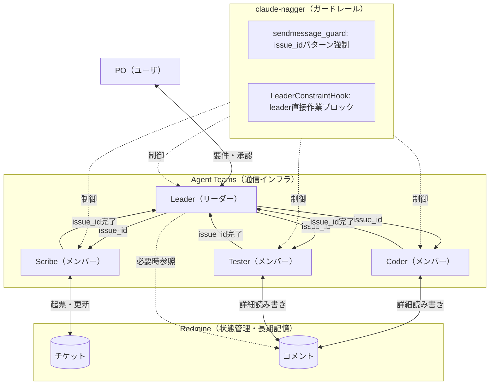

# ticket-tasuki アーキテクチャ検討

## 背景

ticket-tasukiはClaude Codeを活用したTiDD開発支援ツール。複数の役割をエージェントとして分離し、チケット駆動で協働させる。

## 技術的制約（事実）

| 制約 | 状況 | 出典 |
|------|------|------|
| サブエージェント→サブエージェント呼び出し | **不可**（意図的設計） | GitHub Issue #4182, #19077 |
| 実行中セッションへの外部注入 | **不可**（Inkライブラリ制約） | GitHub Issue #15553 |
| `claude -p` 非対話実行 | 可能 | 公式ドキュメント |
| `--resume` セッション継続 | 可能（長期セッションは品質劣化報告あり） | 公式ドキュメント, GitHub #18155 |
| `--output-format json` | 可能 | 公式ドキュメント |
| Max Plan CLI利用 | 固定月額に含まれる（**動的レート制限あり**） | 公式ドキュメント |
| Max Planレート制限 | subagent・CLIプロセス共に**同一アカウントプールを共有** | GitHub #12063, #7007 |
| auto-compaction | コンテキスト約95%到達時に自動要約発火（閾値変更可） | 公式ドキュメント |
| subagentコンテキスト漏洩 | **既知バグ**（tool call詳細が親に漏洩） | GitHub #14118, #15191 |
| コンテキストウィンドウ | 公称200k、実効160k~180k | GitHub #18155, #21739 |
| Agent Teamsメンバー間直接通信 | **可能**（メールボックス機能） | 公式ドキュメント |
| Agent Teams `/resume`復元 | **不可**（in-processメンバー復元不可） | 公式ドキュメント |
| Agent Teams MCP利用 | 公式:可 / 実態:条件次第で不安定 | GitHub #23882, #23999 |
| Agent Teams compactionでチーム喪失 | **既知問題** | GitHub #23620 |
| カスタムsubagentでMCPツール不可 | **OPEN** | GitHub #13605, #15810 |

## 検討した方式

### 方式A: サブエージェント（初期設計）

```
メインエージェント(PM)
+-- coder subagent
+-- tester subagent
+-- scribe subagent
+-- Explore subagent
```

**メリット**:
- 既に動作する実装が存在（ticket-tasuki初期版）
- tools制限による物理的スコープ制御
- オーケストレーター実装不要
- auto-compactionによるコンテキスト管理

**問題**:
- subagentコンテキスト漏洩バグ（#14118, #15191）により、複数subagent運用時に親コンテキストが予期せず圧迫される**実害あり**
- マルチエージェントシナリオでコンテキスト枯渇→フリーズの報告あり（#15892）
- サブエージェント間の直接通信不可 → PM経由必須
- セッション継続不可 → 毎回新規コンテキスト

**注記**: 「コンテキスト蓄積→溢れる」問題はauto-compaction（95%閾値で自動要約）で設計上対処されている。真の問題はsubagentのコンテキスト漏洩バグであり、これはClaude Code本体の修正を待つ必要がある。

### 方式B: Agent SDK

Agent SDKはAnthropicのOSSツールで、SDK自体は無料。API経由の場合は従量課金、Max Plan経由の場合は固定費に含まれる。

**メリット**:
- 各エージェント独立コンテキスト
- セッション継続可能
- 柔軟なネスト・並列実行

**問題**:
- API経由利用時は従量課金（高コスト）
- Max Plan経由利用時はレート制限共有（方式A・Cと同一）
- オーケストレーション実装が必要

### 方式C: CLI複数実行 + Redmine

```
オーケストレーター(Python/Bash)
+-- claude -p PM役 --resume session1
+-- claude -p TL役 --resume session2
+-- claude -p 開発者役 --resume session3
+-- Redmine（外部メモリ）
```

**メリット**:
- 物理的コンテキスト分離（subagent漏洩バグの影響を受けない）
- Redmine強制経由で暗黙知を排除
- セッション継続で各役割のコンテキスト維持可能

**問題**:
- オーケストレーター実装が1プロジェクト規模のコスト
- `claude -p`はワンショット実行であり対話不可
- CLIクラッシュ時のRedmine記載前作業消失リスク

**注記**: レート制限はsubagent方式と同一プールを共有するため、並列実行によるレート消費上の優位性はない。

### 方式D: Conductor（general-purpose subagent + Task tool）

CC-Mirrorの「Conductor」から着想。**Claude Codeの既存機能のみで成立する方式。**

```
メインセッション (Conductor)
+-- Task(subagent_type="general-purpose") → scribe役
+-- Task(subagent_type="general-purpose") → coder役
+-- Task(subagent_type="general-purpose") → tester役
```

**メリット**:
- 追加実装不要（Claude Code既存機能のみ）
- general-purposeでMCP利用可能
- blockedByで宣言的タスク遷移

**問題**:
- subagentコンテキスト漏洩バグ（#14118）の影響あり
- agent_type=general-purposeで全subagentが同一識別 → hookでの役割別制御に工夫が必要
- ツール制限なし（ソフト制約のみ）
- `run_in_background=true`ではMCPツール使用不可

**歴史的経緯**: 方式A/Cの問題点を受け、2026/02/02時点で推奨とされた。詳細はアーキテクチャ再検討_20260202.md参照。

### 方式E: Agent Teams + sendmessage_guard（現行・推奨）

Claude Code公式のAgent Teams機能を使用。2026/02/05にリサーチプレビューとしてリリース。

```
Leader（チームリーダー/人間のプロキシ）
+-- Coder（チームメンバー）: コード実装
+-- Tester（チームメンバー）: テスト実行
+-- Scribe（チームメンバー）: チケット管理
```

**メリット**:
- メンバー間直接通信可能（メールボックス）
- 物理的に完全なコンテキスト分離（漏洩バグの影響なし）
- 自然言語で名前・役割を付与可能（識別問題解消）
- 追加実装不要（公式機能）
- 各メンバーがフルClaude Codeセッションとして動作

**問題**:
- トークンコストが高い（plan mode時に約7倍）
- `/resume`でin-processメンバー復元不可
- compactionでチーム認識喪失の報告あり（#23620）
- MCP利用が条件次第で不安定（#23882, #23999）

**現行の制御機構**:
- **sendmessage_guard**: メンバー間通信にissue_idパターンを強制（チケットIDポインタ渡し）
- **LeaderConstraintHook**: subagent存在時にleaderの直接作業（Edit/Write等）をブロック
- **claude-nagger hookシステム**: ガードレール全般

## 方式比較

| 観点 | A: subagent | B: Agent SDK | C: CLI+Redmine | D: Conductor | **E: Agent Teams** |
|------|-------------|-------------|----------------|--------------|---------------------|
| コスト | Max Plan固定 | API:従量/Max Plan:固定 | Max Plan固定 | Max Plan固定 | **Max Plan固定（高トークン消費）** |
| コンテキスト管理 | 親に蓄積（漏洩バグ） | 各自独立 | 物理分離 | 漏洩バグあり | **完全分離** |
| メンバー間通信 | 不可（PM経由） | 自由 | オーケストレーター経由 | 不可 | **直接通信** |
| セッション継続 | 不可 | 可能 | 可能（品質劣化あり） | 不可 | **不可（復元制限）** |
| MCP | GP:可/カスタム:不可 | 可 | 可 | 可（GP使用） | **公式:可/実態:不安定** |
| 役割識別 | agent_type | 自由 | N/A | `[ROLE:xxx]`プレフィックス | **メンバー名で自然識別** |
| ツール制限 | カスタム:可/GP:不可 | 自由 | N/A | 不可（ソフト制約） | **hook+ソフト制約** |
| レート制限 | 同一プール | 同一プール | 同一プール | 同一プール | **同一プール** |
| 暗黙知排除 | hook併用 | 別途実装 | Redmine強制 | prompt+hook | **sendmessage_guard+hook** |
| 追加実装コスト | 低（既存） | 中 | 高 | なし | **なし（公式機能）** |
| 安定性 | 安定 | 安定 | 未実装 | 安定 | **実験的（改善中）** |

## 推奨アーキテクチャ（方式E）



### 動作フロー

1. ユーザ（PO）がLeaderに要件を伝達
2. LeaderがScribeにチケット起票を委譲（issue_idで指示）
3. LeaderがCoderに実装を委譲（issue_idで指示）
4. Coderが実装結果をRedmineコメントに記載し、Leaderに完了通知
5. LeaderがTesterにテストを委譲
6. LeaderがRedmineコメントを参照してレビュー
7. ユーザに完了報告

### 設計原則

- **チケットIDポインタ渡し**: Agent間通信はissue_idのみ。詳細は必ずRedmineコメント
- **Redmineに書いてないことは存在しない**: セッション終了で揮発する情報はRedmineに永続化
- **sendmessage_guard**: 長文メッセージを防止し、チケットID経由の通信を強制
- **LeaderConstraintHook**: leaderが直接コードを編集することを防止（委譲強制）

## Redmine経由の意義

### 暗黙知の排除

```
従来: エージェントのコンテキスト内に知識が蓄積（見えない）
現行: Redmineに書かないと次に進めない → 全て形式知化
```

### 副次的効果

| 効果 | 説明 |
|------|------|
| 人間介入 | いつでもチケットを確認・修正可能 |
| 監査証跡 | 全意思決定が追跡可能 |
| デバッグ | 問題発生時に経緯を確認可能 |
| 属人化排除 | エージェント交換可能 |
| セッション復元 | `/resume`不可の制限をRedmine永続性で回避 |

## 懸念点と対策

| 懸念 | 対策 |
|------|------|
| 記載粒度の曖昧さ | プロンプトで規約を定義・sendmessage_guardで強制 |
| Redmine I/Oオーバーヘッド | 暗黙知排除のための必要コスト |
| Agent Teams MCP不安定 | in-process+プロジェクトスコープMCPで検証。改善を待つ |
| compactionでチーム喪失 | Redmine永続性でカバー。チケット参照で復帰 |
| トークンコスト増大 | チケットIDポインタ渡しでメッセージ量最小化 |
| レート制限 | 全方式で同一プール共有。メンバー数を最小限に |
| InboxPollerコンテキスト爆発 | チケットID規約でメッセージ量最小化（#23876対策） |
| 長時間セッションで役割劣化 | claude-naggerガードレール、チケットIDによる都度指示 |

## 結論

**方式E（Agent Teams + sendmessage_guard + Redmine）を現行推奨とする。**

理由:
1. メンバー間直接通信により柔軟な協働が可能
2. 物理的なコンテキスト完全分離（漏洩バグの影響なし）
3. 自然言語による役割識別（general-purpose識別問題の解消）
4. sendmessage_guard + LeaderConstraintHookによる強固な制御
5. Redmine強制経由で暗黙知を排除
6. 追加実装不要（公式機能 + claude-naggerフック）

**留意事項**:
- Agent Teamsはまだ実験的機能。MCP周りの不安定さ（#23882, #23999）は改善を待つ
- レート制限は全方式で同一プール共有
- 方式D（Conductor）は方式Eが利用不可な場合のフォールバックとして維持

## 方式変遷の経緯

| 時期 | 方式 | 経緯 |
|------|------|------|
| 初期 | A: subagent | 最初の実装。コンテキスト漏洩バグが実害 |
| 検討のみ | B: Agent SDK | コスト・オーケストレーション負荷で見送り |
| 検討のみ | C: CLI+Redmine | オーケストレーター実装コストが過大 |
| 2026/02/02 | D: Conductor | 追加実装ゼロで成立。general-purpose識別問題が残存 |
| 2026/02/08~ | **E: Agent Teams** | 公式チーム機能。sendmessage_guardで通信制御 |

## 出典

| ID | 出典 | 内容 |
|----|------|------|
| #4182 | [GitHub Issue](https://github.com/anthropics/claude-code/issues/4182) | subagent→subagent呼出不可 |
| #19077 | [GitHub Issue](https://github.com/anthropics/claude-code/issues/19077) | ネストsubagent不可（未解決） |
| #15553 | [GitHub Issue](https://github.com/anthropics/claude-code/issues/15553) | 実行中セッションへの外部注入不可 |
| #14118 | [GitHub Issue](https://github.com/anthropics/claude-code/issues/14118) | subagent tool call詳細が親コンテキストに漏洩 |
| #15191 | [GitHub Issue](https://github.com/anthropics/claude-code/issues/15191) | 8 subagent実行時の親コンテキスト上限到達 |
| #15892 | [GitHub Issue](https://github.com/anthropics/claude-code/issues/15892) | マルチエージェントでコンテキスト枯渇→フリーズ |
| #18155 | [GitHub Issue](https://github.com/anthropics/claude-code/issues/18155) | 実効コンテキスト160k~180k |
| #21739 | [GitHub Issue](https://github.com/anthropics/claude-code/issues/21739) | トークン計算が200k超過 |
| #12063 | [GitHub Issue](https://github.com/anthropics/claude-code/issues/12063) | subagent・CLIが同一レート制限プール共有 |
| #7007 | [GitHub Issue](https://github.com/anthropics/claude-code/issues/7007) | レート制限到達時subagent中断 |
| #13605 | [GitHub Issue](https://github.com/anthropics/claude-code/issues/13605) | カスタムsubagentでMCPツール不可 |
| #23882 | [GitHub Issue](https://github.com/anthropics/claude-code/issues/23882) | Agent TeamsメンバーMCPアクセス不安定 |
| #23999 | [GitHub Issue](https://github.com/anthropics/claude-code/issues/23999) | プラグイン由来MCPサーバー起動失敗 |
| #23620 | [GitHub Issue](https://github.com/anthropics/claude-code/issues/23620) | compactionでチーム認識喪失 |
| #23876 | [GitHub Issue](https://github.com/anthropics/claude-code/issues/23876) | InboxPollerコンテキスト爆発 |
| #23983 | [GitHub Issue](https://github.com/anthropics/claude-code/issues/23983) | PermissionRequestフックがメンバーで不発火 |
| - | [公式ドキュメント](https://code.claude.com/docs/en/sub-agents) | subagent仕様 |
| - | [公式ドキュメント](https://code.claude.com/docs/en/costs) | コスト・auto-compaction |
| - | [公式ドキュメント](https://code.claude.com/docs/en/cli-reference) | CLI リファレンス |
| - | [公式ドキュメント](https://code.claude.com/docs/en/agent-teams) | Agent Teams仕様 |
