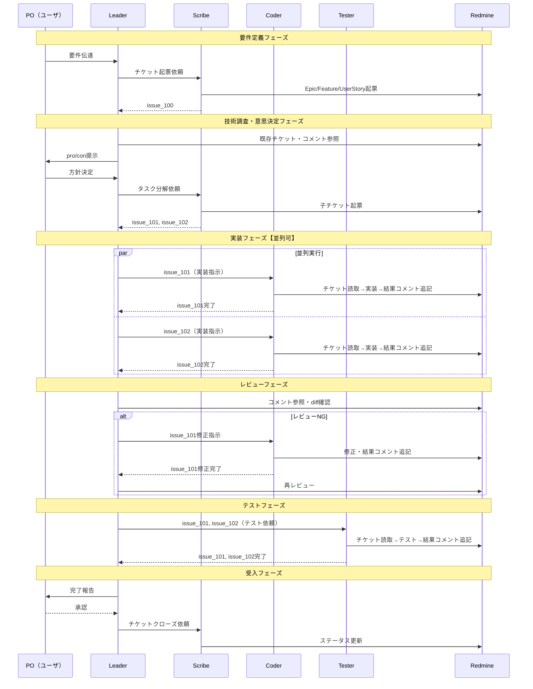
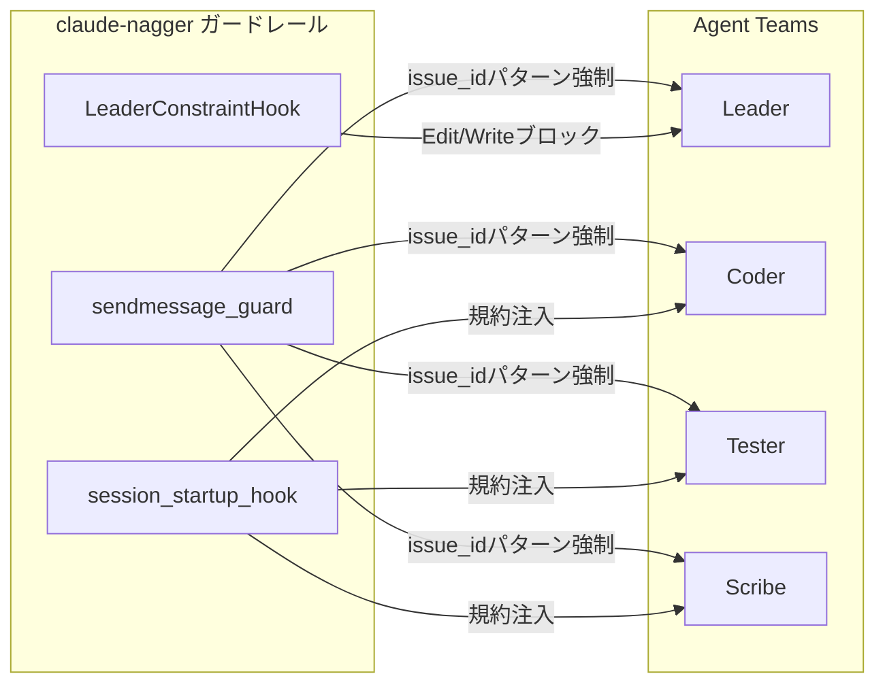

# ticket-tasuki ワークフロー図

## 前提

- **方式E（Agent Teams + sendmessage_guard）**を使用
- Leader = チームリーダー（人間のプロキシ）。読む・判断する・指示する・レビューする
- メンバー間通信はissue_idのみ（sendmessage_guardで強制）
- 詳細情報は全てRedmineチケットコメントに記載
- LeaderConstraintHookにより、leaderはsubagent存在時に直接コード編集不可

## 全体フロー

```mermaid
flowchart TB
    subgraph 要件定義フェーズ
        A[PO: 要件伝達] --> B[Leader: 受領・分析]
        B --> C[Scribe: チケット起票]
    end

    subgraph 技術調査・意思決定フェーズ
        C --> D[Leader: 技術調査・pro/con整理]
        D --> E[PO: 方針決定]
        E --> F[Scribe: タスク分解・子チケット起票]
    end

    subgraph 実装フェーズ【並列可】
        F --> G1[Coder: issue_101]
        F --> G2[Coder: issue_102]
        G1 --> H[Leader: 実装レビュー]
        G2 --> H
    end

    subgraph レビュー・修正ループ
        H --> I{レビューOK?}
        I -->|No| J[Coder: 修正]
        J --> H
        I -->|Yes| K[テストフェーズへ]
    end

    subgraph テストフェーズ
        K --> L[Tester: テスト実行]
        L --> M[Leader: テスト結果確認]
    end

    subgraph 受入フェーズ
        M --> N[PO: 成果物確認・承認]
        N --> O[Scribe: チケットクローズ]
    end
```

## 並列化ポイント

| フェーズ | 並列実行するメンバー | 効果 |
|----------|---------------------|------|
| 実装 | 複数Coder（タスク分解後） | 実装時間短縮 |
| テスト | 複数Tester（独立テスト） | テスト時間短縮 |

## シーケンス図（詳細）



## 通信パターン

### issue_idポインタ渡し

```
Leader → Coder:  "issue_101を実装してください"
Coder → Leader:  "issue_101完了"
Coder → Redmine: 詳細な実装内容・コミットハッシュ・懸念事項をコメント追記
Leader → Redmine: コメント参照してレビュー
```

### sendmessage_guardの制御

sendmessage_guardにより、メンバー間のメッセージにissue_idパターンが強制される。長文メッセージやチケットID無しの通信はブロックされる。

### LeaderConstraintHookの制御

subagent（チームメンバー）が存在する場合、leaderのEdit/Write/NotebookEdit等のファイル変更ツールがブロックされる。leaderは必ずcoderに委譲する。

## 制御機構との関係



## 注意事項

- メンバー間直接通信は可能だが、内容はissue_idのみに制限（sendmessage_guard）
- 詳細情報の受け渡しは必ずRedmineコメント経由
- Leaderは技術調査が必要な場合、general-purposeサブエージェントを個別に起動可能
- 各メンバーは独立したClaude Codeセッションとして動作するため、コンテキストは完全分離
