# ticket-tasuki ワークフロー図

## 前提

- **方式E（Agent Teams）** を使用
- Leader = チームリーダー（人間のプロキシ）。読む・判断する・指示する
- PMO・tech-leadは**常駐agent**（セッション中alive、コンテキスト蓄積）
- coder・researcher・testerは**都度起動**
- 詳細情報はRedmineチケットコメントに記載（経緯の永続化）
- Scribeは廃止、PMOがチケットCRUDを兼務

## Agent構成

| Agent | 種別 | 役割 |
|-------|------|------|
| Leader | - | 意思決定・コンテクスト管理・オーナー連携 |
| PMO | 常駐 | ワークフロー相談・チケット管理(CRUD)・プロセス監査 |
| tech-lead | 常駐 | 設計レビュー・コード品質チェック・エスカレーション判断 |
| Coder | 都度起動 | コード実装。実装後tech-leadにレビュー依頼 |
| Researcher | 都度起動 | 技術調査・コードベース調査 |
| Tester | 都度起動 | テスト設計・実行 |

## 全体フロー

```mermaid
flowchart TB
    subgraph セッション開始
        A[PO: 要件伝達] --> B[Leader: 受領・分析]
        B --> C[PMO常駐起動]
        C --> D[PMO: ワークフロー提案]
    end

    subgraph 技術調査フェーズ
        D --> E[Researcher: 調査]
        E --> F[Leader: 方針整理 → PO判断]
        F --> G[PMO: タスク分解・チケット起票]
    end

    subgraph 実装準備
        G --> H[tech-lead常駐起動]
        H --> I[Leader: Coder起動]
    end

    subgraph 実装・レビューループ【peer-to-peer】
        I --> J[Coder: 実装]
        J --> K[Coder → tech-lead: レビュー依頼]
        K --> L{tech-lead: レビュー}
        L -->|修正必要| M[tech-lead → Coder: 修正指示]
        M --> J
        L -->|設計判断必要| N[tech-lead → Leader: エスカレーション]
        L -->|承認| O[tech-lead → Leader: 承認報告]
    end

    subgraph テスト・クローズ
        O --> P[Tester: テスト実行]
        P --> Q[PMO: クローズ前監査]
        Q --> R[PMO: チケットクローズ]
        R --> S[Leader → PO: 完了報告]
    end
```

## Peer-to-Peerレビューループ（詳細）

Leaderを介さず、Coder ⇄ tech-leadが直接やり取りする。
Leaderのコンテキスト消費を最小化する設計。

```mermaid
sequenceDiagram
    participant L as Leader
    participant C as Coder
    participant TL as tech-lead（常駐）
    participant RM as Redmine

    L->>C: issue_{id} 実装指示
    C->>RM: 実装結果・コミットハッシュをコメント
    C->>TL: issue_{id} レビュー依頼

    alt レビューOK
        TL->>RM: レビュー承認コメント
        TL->>L: issue_{id} 承認
    else 修正必要
        TL->>RM: 指摘事項コメント
        TL->>C: issue_{id} 修正指示
        C->>RM: 修正結果コメント
        C->>TL: issue_{id} 再レビュー依頼
    else 設計判断必要
        TL->>RM: エスカレーション理由コメント
        TL->>L: issue_{id} 要判断
    end
```



## 全体シーケンス図


## 常駐Agent

| Agent | 起動タイミング | シャットダウン | 目的 |
|-------|-------------|-------------|------|
| PMO | セッション開始時 | セッション終了時 | ワークフロー一貫性・チケット管理 |
| tech-lead | coder初回起動前 | セッション終了時 | レビューコンテキスト蓄積 |

## 3層防御設計（tech-leadレビュー確保）

| Layer | 場所 | 責務 | 内容 |
|-------|------|------|------|
| 予防 | leader規約 (config.yaml) | 起動保証 | coderを起動する際はtech-leadも常駐させよ |
| 助言 | PMO定義 | ワークフロー提案 | tech-lead常駐を含むワークフローを提案する |
| 検知 | coder定義 | フォールバック | tech-lead不在時は実装せずleaderにエスカレーション |

## 並列化ポイント

| フェーズ | 並列実行 | 効果 |
|----------|---------|------|
| 実装 | 複数Coder（Task分解後） | 実装時間短縮 |
| テスト | 複数Tester（独立テスト） | テスト時間短縮 |
| 調査 | 複数Researcher | 調査時間短縮 |

※並列Coder起動時もtech-leadは1つで常駐。各Coderがレビュー依頼を送る。

## 通信パターン

### peer-to-peer（Coder ⇄ tech-lead）

```
Coder → tech-lead: "issue_101 レビュー依頼"
tech-lead → Coder:  "issue_101 修正指示"
tech-lead → Leader: "issue_101 承認" / "issue_101 要判断"
詳細はRedmineコメント経由
```

### leader経由（その他）

```
Leader → Coder:      "issue_101 実装指示"
Leader → Researcher: "issue_101 調査依頼"
Leader → Tester:     "issue_101 テスト依頼"
Leader ⇄ PMO:       ワークフロー相談・監査依頼・チケット操作依頼
```

## 旧設計からの変更点

| 項目 | 旧 | 新 | 理由 |
|------|----|----|------|
| Scribe | 独立agent | PMOに統合 | 利用頻度低下、PMOとの責務重複 |
| tech-lead | 都度起動（実質未使用） | 常駐 | レビューコンテキスト蓄積 |
| レビューフロー | leader経由 | Coder ⇄ tech-lead直接 | leaderコンテキスト節約 |
| PMO | 監査専任 | 監査 + チケットCRUD | Scribe統合 |
| role追跡 | task_spawn_guard | agent_type（方式E native） | 方式D遺構を廃止 |
| Conductor規約 | conductor/*.md | 廃止 | 方式E移行により不要 |
