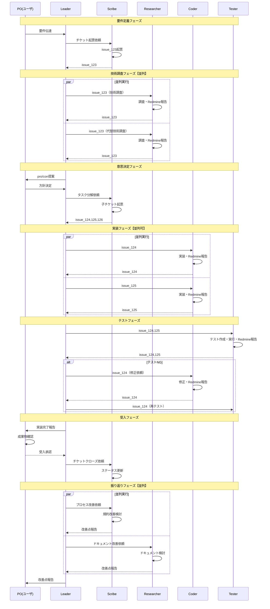
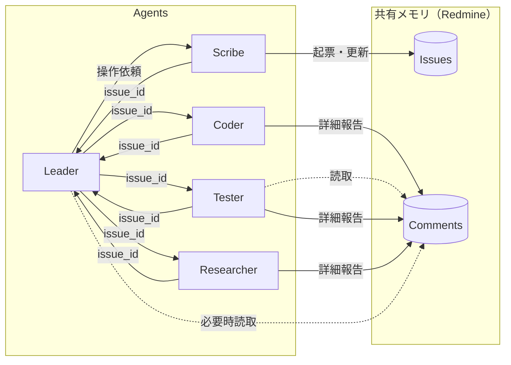

# ticket-tasuki ワークフロー図（general-purpose方式）

## 前提・制約

### 技術的制約
- サブエージェントからサブエージェントは呼び出し不可（Claude Code制約）
- 全通信はLeader（メインエージェント）経由必須
- カスタムagentはMCPツール利用不可（#13605バグ）→ general-purpose一択
- general-purposeはシステムプロンプト制御・ツール制限不可

### 設計方針: Redmine共有メモリパターン
- Redmineコメントを共有メモリとして活用
- Agent間の詳細情報はRedmine経由で受け渡し
- Leaderには「コメント追記済」事実のみ報告（ポインタ渡し）
- Leaderコンテキスト節約 + 情報の永続化

## Agent構成

| Agent | 役割 | 主な責務 |
|-------|------|----------|
| **Leader** | PM・コンテキスト管理 | 意思決定、タスク振り分け、進捗集約 |
| **Coder** | 実装担当 | コード実装、単体テスト、コミット |
| **Tester** | テスト担当 | テストケース作成、E2Eテスト、品質検証 |
| **Researcher** | 技術調査 | 最新技術調査、ライブラリ選定、PoC |
| **Scribe** | Redmine操作専任 | チケット起票、コメント追記、ステータス更新 |

### Agent起動方法
```python
# general-purposeで全Agent統一（MCPツール利用のため）
# 役割定義・制約はclaude-nagger config.yamlで管理
# タスク詳細はRedmineチケットに記載済
Task(subagent_type="general-purpose", prompt="""
[Role: Coder]
issue_123
""")
```

## 全体フロー

```mermaid
flowchart TB
    subgraph 要件定義フェーズ
        A[PO: 要件伝達] --> B[Leader: 受領・分析]
        B --> C[Scribe: チケット起票]
        C --> B
    end

    subgraph 技術調査フェーズ【並列可】
        B --> D1[Researcher1: 技術A調査]
        B --> D2[Researcher2: 技術B調査]
        D1 --> F[Leader: 調査結果集約]
        D2 --> F
    end

    subgraph 意思決定フェーズ
        F --> G[Leader: pro/con整理]
        G --> H[PO: 方針決定]
        H --> I[Scribe: タスク分解・起票]
        I --> H2[Leader: タスク確認]
    end

    subgraph 実装フェーズ【並列可】
        H2 --> J1[Coder1: タスクA]
        H2 --> J2[Coder2: タスクB]
        J1 --> L[Leader: 実装完了集約]
        J2 --> L
    end

    subgraph テストフェーズ
        L --> M[Tester: テスト実施]
        M --> N[Leader: テスト結果確認]
    end

    subgraph 受入フェーズ
        N --> O[PO: 成果物確認・承認]
        O --> P[Scribe: チケットクローズ]
    end

    subgraph 振り返りフェーズ【並列可】
        P --> R[Scribe: プロセス改善検討]
        P --> S[Researcher: ドキュメント改善検討]
        R --> T[Leader: 改善点集約・報告]
        S --> T
        T --> U[PO: 改善点受領]
    end
```

## シーケンス図（詳細）



## Leaderコンテキスト節約の仕組み

### 問題: Leaderコンテキスト肥大化
- 全Agentの詳細報告を受けるとLeaderコンテキストが急速に消費
- 特に実装詳細・調査結果・テストログは大量テキスト

### 解決: ポインタ渡しパターン

```
従来方式（NG）:
  Coder → Leader: 「以下の変更を行いました。
                    - src/foo.py: 100行追加
                    - tests/test_foo.py: 50行追加
                    - 詳細説明500文字...」

ポインタ渡し方式（推奨）:
  Coder → Redmine: 詳細をコメント追記
  Coder → Leader: 「issue_124にコメント追記済」
```

### Leaderが詳細を必要とする場合
1. Redmineコメントを読み取り（必要時のみ）
2. 要約をLeaderコンテキストに保持
3. 詳細は常にRedmine参照

### 効果
- Leaderコンテキスト消費: 大幅削減
- 情報の永続化: Redmineに履歴として残る
- 追跡可能性: 誰が何をいつ報告したか明確

## 並列化可能ポイント

| フェーズ | 並列実行Agent | 前提条件 | 効果 |
|----------|---------------|----------|------|
| 技術調査 | Researcher x N | 調査対象が独立 | 調査時間短縮 |
| 実装 | Coder x N | タスク分解済・依存なし | 実装時間短縮 |
| テスト | Tester x N | テスト対象が独立 | テスト時間短縮 |

### 並列実行の実装

```python
# Leaderからの並列起動（フォアグラウンド）
# MCPツール利用のためrun_in_background=Falseが必須

# 方法1: 同一レスポンスで複数Task呼び出し
Task(subagent_type="general-purpose", prompt="[Researcher] issue_123技術A調査...")
Task(subagent_type="general-purpose", prompt="[Researcher] issue_123技術B調査...")
# → Claude Codeが並列実行を判断

# 注意: バックグラウンド実行はMCPツール使用不可（#13254）
```

## 情報フロー図



## 注意事項

1. **MCPツール利用制約**: カスタムagent（#13605）修正まではgeneral-purpose必須
2. **役割定義**: prompt内に明示的に埋め込む必要あり（システムプロンプト制御不可）
3. **ツール制限不可**: 意図しないツール使用を防げない → prompt内で制約記述
4. **コンテキスト分離**: 各Agentは独立コンテキスト → 必要情報は明示的に渡す
5. **Redmine依存**: Redmine障害時は情報共有不可 → フォールバック検討要
