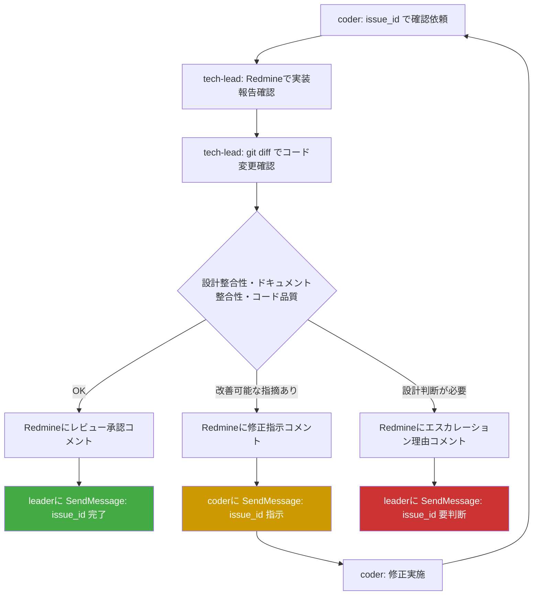
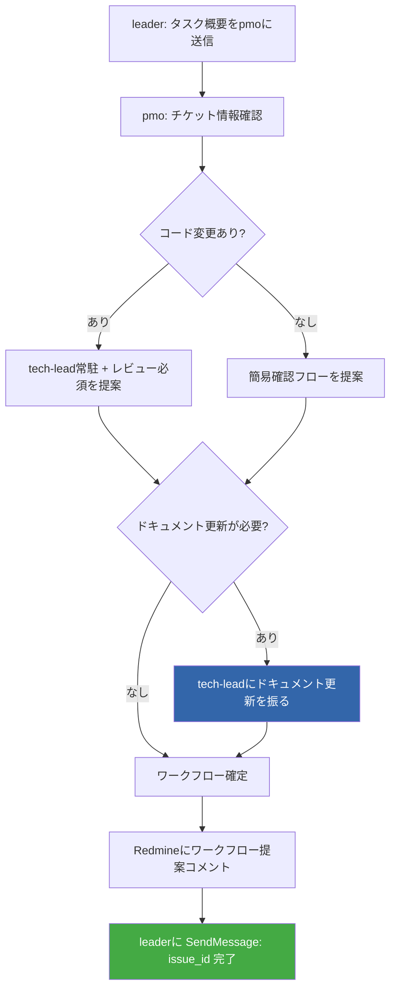

# tasukiワークフロー図

## tech-lead peer-to-peerレビューフロー

### 重要ルール
- 承認 → **leaderに**報告（coderのタスク完了通知）
- 修正指示 → **coderに**直接送信（leader不介在）
- エスカレーション → **leaderに**送信（設計判断はleader/オーナーの責務）

## PMOワークフロー提案フロー

## OK/NG例

### OK: 正しいワークフロー
- coder実装完了 → tech-leadにpeer-to-peerレビュー依頼 → 承認後leaderに完了報告
- ドキュメント更新必要 → tech-leadに振る（tech-leadがvibes/docs編集・コミット）
- 設計判断が必要 → tech-leadがleaderにエスカレーション

### NG: 禁止パターン
- **NG**: PMOがcoderにドキュメント修正を指示する（ドキュメント更新はtech-leadの責務）
- **NG**: tech-leadが承認後coderに完了報告する（承認報告先はleader）
- **NG**: coderがleaderを介さずtech-leadにレビュー依頼をスキップする
- **NG**: tech-leadがleaderを介さずPMO/researcherに直接送信する
