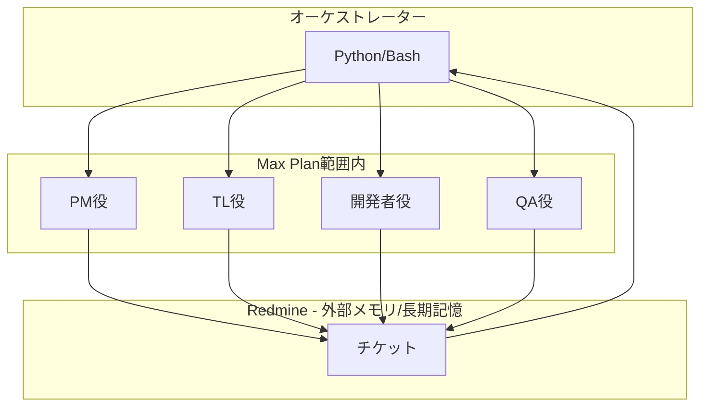
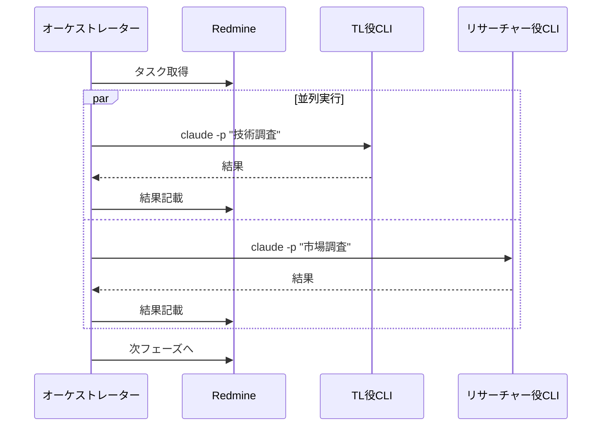

# ticket-tasuki アーキテクチャ検討

## 背景

ticket-tasukiはClaude Codeを活用したTiDD開発支援ツール。複数の役割（PM、テクニカルリード、開発者、QA等）をエージェントとして分離し、チケット駆動で協働させる。

## 技術的制約（事実）

| 制約 | 状況 | 出典 |
|------|------|------|
| サブエージェント→サブエージェント呼び出し | **不可**（意図的設計） | GitHub Issue #4182, #19077 |
| 実行中セッションへの外部注入 | **不可**（Inkライブラリ制約） | GitHub Issue #15553 |
| `claude -p` 非対話実行 | 可能 | 公式ドキュメント |
| `--resume` セッション継続 | 可能（長期セッションは品質劣化報告あり） | 公式ドキュメント, GitHub #18155 |
| `--output-format json` | 可能 | 公式ドキュメント |
| Max Plan CLI利用 | 固定月額に含まれる（**動的レート制限あり**） | 公式ドキュメント |
| Max Planレート制限 | subagent・CLIプロセス共に**同一アカウントプールを共有** | GitHub #12063, #7007 |
| auto-compaction | コンテキスト約95%到達時に自動要約発火（閾値変更可） | 公式ドキュメント |
| subagentコンテキスト漏洩 | **既知バグ**（tool call詳細が親に漏洩） | GitHub #14118, #15191 |
| コンテキストウィンドウ | 公称200k、実効160k〜180k | GitHub #18155, #21739 |

## 検討した方式

### 方式A: サブエージェント（現行設計）

```
メインエージェント(PM)
├── coder subagent
├── tester subagent
├── scribe subagent
└── Explore subagent
```

**メリット**:
- 既に動作する実装が存在（ticket-tasuki現行版）
- tools制限による物理的スコープ制御
- オーケストレーター実装不要
- auto-compactionによるコンテキスト管理

**問題**:
- subagentコンテキスト漏洩バグ（#14118, #15191）により、複数subagent運用時に親コンテキストが予期せず圧迫される**実害あり**
- マルチエージェントシナリオでコンテキスト枯渇→フリーズの報告あり（#15892）
- サブエージェント間の直接通信不可 → PM経由必須
- セッション継続不可 → 毎回新規コンテキスト

**注記**: 「コンテキスト蓄積→溢れる」問題はauto-compaction（95%閾値で自動要約）で設計上対処されている。真の問題はsubagentのコンテキスト漏洩バグであり、これはClaude Code本体の修正を待つ必要がある。

### 方式B: Agent SDK

Agent SDKはAnthropicのOSSツールで、SDK自体は無料。API経由の場合は従量課金、Max Plan経由の場合は固定費に含まれる。

**メリット**:
- 各エージェント独立コンテキスト
- セッション継続可能
- 柔軟なネスト・並列実行

**問題**:
- API経由利用時は従量課金（高コスト）
- Max Plan経由利用時はレート制限共有（方式A・Cと同一）
- オーケストレーション実装が必要

### 方式C: CLI複数実行 + Redmine（推奨）

```
オーケストレーター(Python/Bash)
├── claude -p PM役 --resume session1
├── claude -p TL役 --resume session2
├── claude -p 開発者役 --resume session3
└── Redmine（外部メモリ）
```

**メリット**:
- 物理的コンテキスト分離（subagent漏洩バグの影響を受けない）
- Redmine強制経由で暗黙知を排除
- セッション継続で各役割のコンテキスト維持可能

**注記**: レート制限はsubagent方式と同一プールを共有するため、並列実行によるレート消費上の優位性はない。

## 推奨アーキテクチャ



### 動作フロー

1. オーケストレーターがRedmineからタスク取得
2. 適切な役割のCLIプロセスを起動
3. CLIプロセスが処理実行
4. 結果をRedmineに記載
5. CLIプロセス終了（コンテキスト破棄）
6. 次のタスクへ

## 比較

| 観点 | サブエージェント | Agent SDK | CLI + Redmine |
|------|------------------|-----------|---------------|
| コスト | Max Plan固定 | API:従量課金 / Max Plan:固定 | **Max Plan固定** |
| コンテキスト管理 | 親に蓄積（漏洩バグあり） | 各自独立 | **物理的に分離** |
| コンテキスト保護 | auto-compactionあり（バグ#14118で不安定） | 各自独立 | **プロセス分離で確実** |
| セッション継続 | 不可 | 可能 | **可能（品質劣化報告あり）** |
| ネスト | 不可 | 可能 | CLIからCLI呼出は可能（管理複雑化） |
| 並列実行 | メインから | 自由 | 自由 |
| レート制限 | 同一プール | 同一プール | **同一プール（差異なし）** |
| 暗黙知排除 | scribe+hook併用で対応可 | 別途実装必要 | **Redmine強制経由** |
| 実装コスト | 低（既存） | 中 | **高（オーケストレーター実装必要）** |

## Redmine経由の意義

### 暗黙知の排除

```
従来: エージェントのコンテキスト内に知識が蓄積（見えない）
提案: Redmineに書かないと次に進めない → 全て形式知化
```

### 設計原則

- 各CLIプロセスはセッション終了時にコンテキストを「忘れる」
- 再開時はRedmineから読む
- **Redmineに書いてないことは存在しない**

### 副次的効果

| 効果 | 説明 |
|------|------|
| 人間介入 | いつでもチケットを確認・修正可能 |
| 監査証跡 | 全意思決定が追跡可能 |
| デバッグ | 問題発生時に経緯を確認可能 |
| 属人化排除 | エージェント交換可能 |

## 実装例

```python
import subprocess
import json

def claude_query(prompt: str, role: str, session_id: str = None) -> dict:
    cmd = [
        "claude", "-p", prompt,
        "--output-format", "json",
        "--append-system-prompt", f"あなたは{role}です"
    ]
    if session_id:
        cmd.extend(["--resume", session_id])

    result = subprocess.run(cmd, capture_output=True, text=True)
    return json.loads(result.stdout)

# 使用例
tl_result = claude_query("技術調査して", role="テクニカルリード")
# → Redmineに記載
dev_result = claude_query("実装して", role="開発者")
# → Redmineに記載
```

## 並列実行



## 懸念点と対策

| 懸念 | 対策 |
|------|------|
| 記載粒度の曖昧さ | PMO役が規約を定義・監視 |
| Redmine I/Oオーバーヘッド | 暗黙知排除のための必要コスト |
| 緊急時の速度低下 | 緊急フローを別途定義 |
| オーケストレーター実装 | Python/Bashで実装が必要（エラーハンドリング・セッション管理・競合制御含む） |
| レート制限 | 全方式で同一プール共有。並列実行数の制御が必要 |
| subagent漏洩バグ修正時 | 方式Cの最大メリット（物理的分離）が相対化される。移行判断の再評価が必要 |
| CLIプロセス中間失敗 | Redmine記載前クラッシュ時の作業消失リスク。リカバリ手順の定義が必要 |

## 結論

**CLI複数実行 + Redmine経由方式を推奨**

理由:
1. Max Plan固定でコスト予測可能
2. サブエージェントの技術的制約（ネスト不可）を回避
3. subagentコンテキスト漏洩バグ（#14118, #15191）の影響を物理的に回避
4. Redmine強制経由で暗黙知を排除
5. 人間との協働が自然
6. セッション継続で各役割のコンテキスト維持可能

**留意事項**:
- レート制限は方式A/B/Cで同一（方式C固有の優位性ではない）
- subagent漏洩バグがClaude Code本体で修正された場合、方式Aの再評価が必要
- オーケストレーター実装は懸念テーブルに記載の通り非自明なコストを伴う

## 出典

| ID | 出典 | 内容 |
|----|------|------|
| #4182 | [GitHub Issue](https://github.com/anthropics/claude-code/issues/4182) | subagent→subagent呼出不可 |
| #19077 | [GitHub Issue](https://github.com/anthropics/claude-code/issues/19077) | ネストsubagent不可（未解決） |
| #15553 | [GitHub Issue](https://github.com/anthropics/claude-code/issues/15553) | 実行中セッションへの外部注入不可 |
| #14118 | [GitHub Issue](https://github.com/anthropics/claude-code/issues/14118) | subagent tool call詳細が親コンテキストに漏洩 |
| #15191 | [GitHub Issue](https://github.com/anthropics/claude-code/issues/15191) | 8 subagent実行時の親コンテキスト上限到達 |
| #15892 | [GitHub Issue](https://github.com/anthropics/claude-code/issues/15892) | マルチエージェントでコンテキスト枯渇→フリーズ |
| #18155 | [GitHub Issue](https://github.com/anthropics/claude-code/issues/18155) | 実効コンテキスト160k〜180k |
| #21739 | [GitHub Issue](https://github.com/anthropics/claude-code/issues/21739) | トークン計算が200k超過 |
| #12063 | [GitHub Issue](https://github.com/anthropics/claude-code/issues/12063) | subagent・CLIが同一レート制限プール共有 |
| #7007 | [GitHub Issue](https://github.com/anthropics/claude-code/issues/7007) | レート制限到達時subagent中断 |
| - | [公式ドキュメント](https://code.claude.com/docs/en/sub-agents) | subagent仕様 |
| - | [公式ドキュメント](https://code.claude.com/docs/en/costs) | コスト・auto-compaction |
| - | [公式ドキュメント](https://code.claude.com/docs/en/cli-reference) | CLI リファレンス |
| - | [公式ドキュメント](https://code.claude.com/docs/en/headless) | ヘッドレス実行 |

## 次のステップ

- [ ] オーケストレーター実装（Python）— エラーハンドリング・セッション管理・競合制御含む
- [ ] Redmine MCP連携
- [ ] 各役割のプロンプト定義
- [ ] チケット記載規約の策定
- [ ] 緊急フローの定義
- [ ] subagent漏洩バグ修正時の方式A再評価基準の定義
