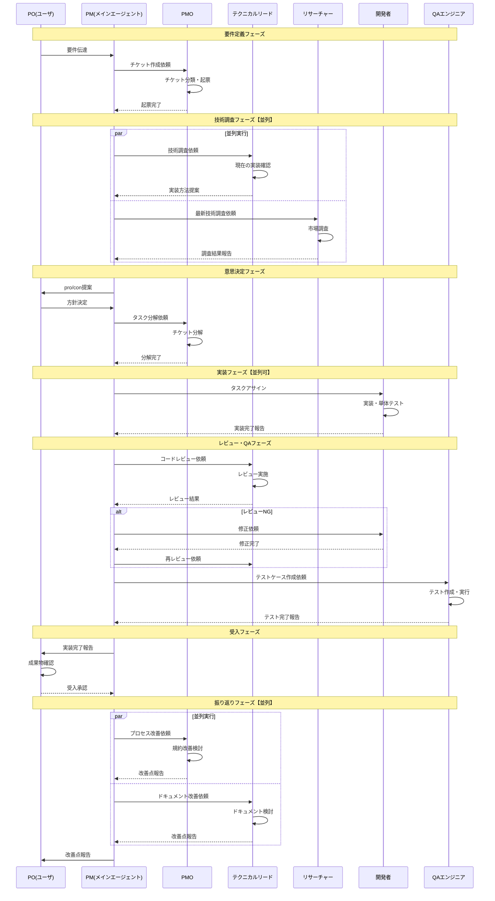

# ticket-tasuki ワークフロー図

## 前提

- Claude Codeのメインエージェント = PM
- サブエージェントからサブエージェントは呼び出し不可（技術的制約）
- 全ての通信はPM経由

## 全体フロー

```mermaid
flowchart TB
    subgraph 要件定義フェーズ
        A[PO: 要件伝達] --> B[PM: 受領]
        B --> C[PMO: チケット起票]
    end

    subgraph 技術調査フェーズ【並列可】
        B --> D[テクニカルリード: 技術調査]
        B --> E[リサーチャー: 最新技術調査]
        D --> F[PM: 調査結果集約]
        E --> F
    end

    subgraph 意思決定フェーズ
        F --> G[PM: pro/con提案]
        G --> H[PO: 方針決定]
        H --> I[PMO: タスク分解]
    end

    subgraph 実装フェーズ【並列可】
        I --> J1[開発者1: タスクA]
        I --> J2[開発者2: タスクB]
        I --> J3[開発者3: タスクC]
        J1 --> K[PM: 実装完了集約]
        J2 --> K
        J3 --> K
    end

    subgraph レビュー・QAフェーズ
        K --> L[テクニカルリード: コードレビュー]
        L --> M{レビューOK?}
        M -->|No| N[開発者: 修正]
        N --> L
        M -->|Yes| O[QA: テストケース作成・実行]
        O --> P[PM: テスト結果確認]
    end

    subgraph 受入フェーズ
        P --> Q[PO: 成果物確認・承認]
    end

    subgraph 振り返りフェーズ【並列可】
        Q --> R[PMO: プロセス改善検討]
        Q --> S[テクニカルリード: ドキュメント改善検討]
        R --> T[PM: 改善点集約・報告]
        S --> T
        T --> U[PO: 改善点受領]
    end
```

## 並列化ポイント

| フェーズ | 並列実行するサブエージェント | 効果 |
|----------|------------------------------|------|
| 技術調査 | テクニカルリード + リサーチャー | 調査時間短縮 |
| 実装 | 複数開発者（タスク分解後） | 実装時間短縮 |
| 振り返り | PMO + テクニカルリード | 改善検討の並列化 |

## シーケンス図（詳細）



## Claude Code実装での並列呼び出し

メインエージェント（PM）から複数サブエージェントを並列起動する場合、1つのレスポンスで複数のTask toolを呼び出す。

```markdown
# 技術調査フェーズの並列実行例

PMが以下を同時に実行:
- Task(subagent_type="tech-lead", prompt="現在の技術スタックを確認し実装方法を提案")
- Task(subagent_type="researcher", prompt="SSO連携の最新ライブラリを調査")

両方の結果がPMに返却され、PMが集約してPOに提案
```

## 注意事項

- サブエージェントからサブエージェントは呼び出せない（Claude Code技術的制約）
- 並列実行はメインエージェント（PM）からのみ可能
- 各サブエージェントは独立したコンテキストで動作するため、必要な情報は明示的に渡す必要がある
